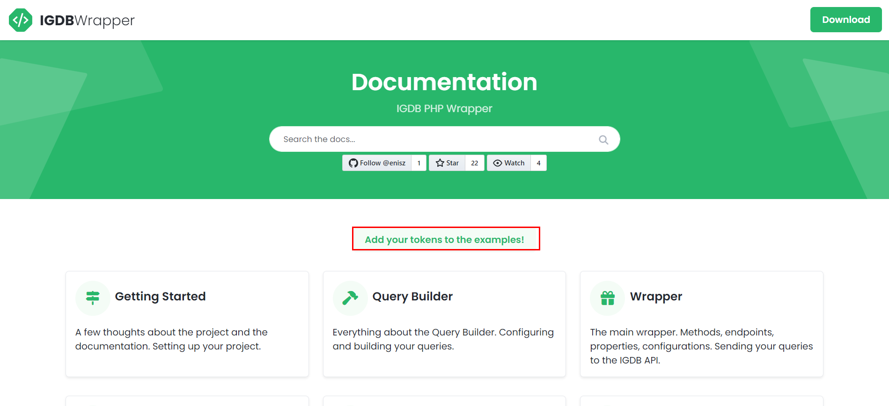
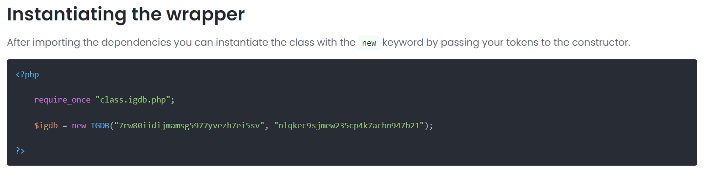

# Getting Started

Welcome to the IGDB Wrapper documentation! This documentation will cover all of the functionalities of this wrapper with lots of example codes. To personalise these codes you can add your own tokens to this documentation on the main page (click on the logo in the top left corner to go back). This way every code example where the tokens are required will contain your own tokens.

The wrapper's main purpose is to provide a simple solution to fetch data from IGDB's database using PHP. The wrapper contains endpoint methods for every IGDB API endpoints and even more!

To have access to IGDB's database you have to register a Twitch Account and have your own `client_id` and `access_token`. Refer to the [Account Creation](https://api-docs.igdb.com/#account-creation) and [Authentication](https://api-docs.igdb.com/#authentication) sections of the [IGDB API Documentation](https://api-docs.igdb.com/) for details.

## Using the documentation

The documentation contains a lot of copy-paste example codes. In most cases, the code snippets contains the instantiation of the `IGDB` class. The constructor of this class will require you to pass your `client_id` and `access_token`. If you would like to have example codes with your personal tokens you can provide these on the front page of the documentation. To get back to the main page, just click the logo on the top left corner.



> If you chose to save the tokens these will be stored only in your browser locally! Find out the details there!

After your tokens are set the example codes will contain your tokens which are ready to copy.



If you want to delete your tokens you can click the Delete the tokens button anytime.

## Installing the application

The documentation is available as a progressive web app (PWA). This means you can install the documentation as an application on your device. Even on PC!

Check out [this article](https://developer.mozilla.org/en-US/docs/Web/Progressive_web_apps/Guides/Installing) how to do so.

## Setting up your project

The project has multiple PHP files which are in the `src` folder of the repository:
 - **IGDB.php**: the wrapper classx
 - **IGDBQueryBuilder.php**: the query builder
 - **IGDBConstants.php**: global constants for the package
 - **IGDBUtils.php**: utility and helper methods
 - **class.igdb.php**: entry point of the package
 - **IGDBEndpointException.php**: an exception thrown by the IGDB wrapper endpoint methods
 - **IGDBInvalidParameterException.php**: an exception thrown by the Query Builder configuring methods

> Feel free to update the entry point file according to your file structure. Make sure to check each file as all of them includes the required files.

## Instantiating the wrapper

The wrapper will need your `client_id` and [generated](https://api-docs.igdb.com/#authentication) `access_token`.

```php
$igdb = new IGDB("{client_id}", "{access_token}");
```

> The wrapper itself does not validate your tokens. If your credentials are invalid you will get an `IGDBEndpointException` from the [endpoint methods](#endpoints) when you are sending your queries.

## Building Queries

There is a helper class to build apicalypse queries called [`IGDBQueryBuilder`](#query-builder). With this class you can easily build parameterized queries. The parameters in the example below are valid, so the `$query` variable will hold the valid apicalypse string.

### Example {.tabset}
#### Source
```php
<?php

    $builder = new IGDBQueryBuilder();

    try {
        $query = $builder
            ->search("uncharted 4")
            ->fields("id, name")
            ->limit(1)
            ->build();

        echo $query;
    } catch (IGDBInvalidParameterException $e) {
        // Invalid argument passed to one of the methods
        echo $e->getMessage();
    }
?>
```

#### Result
```text
fields id,name;
search "uncharted 4";
limit 1;
```
### {-}

> For more details on the Query Builder refer to the [Query Builder section](#query-builder) of this documentation.

## Sending Queries to IGDB

When your `$igdb` object is created you can send your queries to the IGDB API right away. There are multiple [endpoint methods](#endpoints) which will allow you to fetch data from the respective [IGDB Endpoint](https://api-docs.igdb.com/#endpoints). These endpoint methods in the wrapper will accept
 - [apicalypse](https://api-docs.igdb.com/#apicalypse-1) formatted query string
 - configured [`IGDBQueryBuilder`](#query-builder) instance

## Example {.tabset}
### Source
```php
<?php

    $igdb = new IGDB("{client_id}", "{access_token}");
    $builder = new IGDBQueryBuilder();

    $builder
        ->search("uncharted 4")
        ->fields("id, name")
        ->limit(1);

    try {
        // either an apicalypse query string
        $result = $igdb->game('search "uncharted 4"; fields id,name; limit 1;');
        // or an IGDBQueryBuilder instance
        $result = $igdb->game($builder);
        // or an apicalypse query string built from the query builder
        $result = $igdb->game($builder->build());
    } catch (IGDBEndpointException $e) {
        // Something went wrong, we have an error
        echo $e->getMessage();
    }

?>
```

### Result

```text
array (size=1)
  0 =>
    object(stdClass)[2]
      public 'id' => int 7331
      public 'name' => string 'Uncharted 4: A Thief's End' (length=26)
```
## {-}

> For more details on the IGDB Wrapper refer to [The Wrapper section](#the-wrapper) of this documentation.

## Handling errors

There are two main type of errors which could occur when using the wrapper:
 - **"local" errors**: when using the [Query Builder](#query-builder) to build your queries you may pass invalid parameters to the [configuring methods](#configuring-methods). These methods could throw `IGDBInvalidParameterException` if an invalid parameter or invalid type of parameter is passed. Head to the [Handling Builder Errors](#handling-builder-errors) section to find out more.

 - **"remote" errors**: when a query is sent to the IGDB API, but for some reason the query fails. This happens only, when a non-successful response code is recieved from the API. In this case the [endpoint methods](#endpoints) will throw an `IGDBEndpointException`. Head to the [Handling Request Errors](#handling-request-errors) section to find out more.
