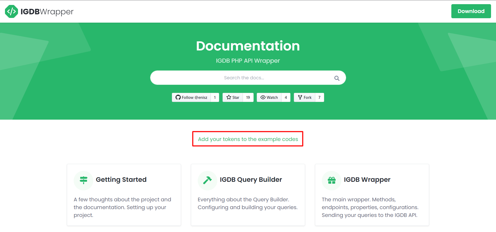
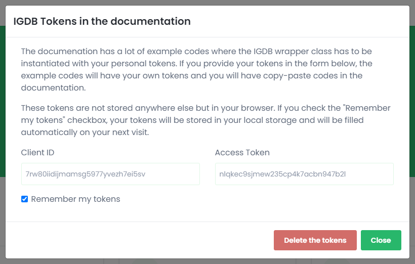
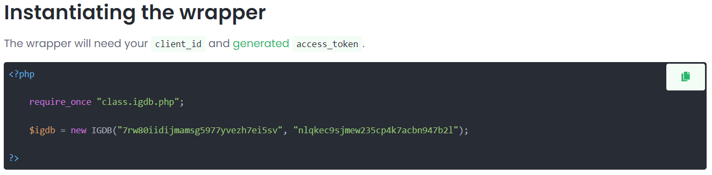

# Getting Started

```php
<?php

    $igdb = new IGDB("{{client_id}}", "{{access_token}}");

?>
```

## welcome

Welcome to the IGDB Wrapper documentation! This documentation will cover all of the functionalities of this wrapper with lots of example codes. To personalise these codes you can add your own tokens to this documentation on the main page (click on the logo in the top left corner to go back). This way every code example where the tokens are required will contain your own tokens.

The wrapper's main purpose is to provide a simple solution to fetch data from IGDB's database using PHP. The wrapper contains endpoint methods for every IGDB API endpoints and even more!

To have access to IGDB's database you have to register a Twitch Account and have your own `client_id` and `access_token`. Refer to the [Account Creation](https://api-docs.igdb.com/#account-creation) and [Authentication](https://api-docs.igdb.com/#authentication) sections of the [IGDB API Documentation](https://api-docs.igdb.com/) for details.

## Using the documentatioycx

The documentation contains a lot of copy-paste example codes. In most cases, the code snippets contains the instantiation of the `IGDB` class. The constructor of this class will require you to pass your `client_id` and `access_token`. If you would like to have example codes with your personal tokens you can provide these on the front page of the documentation. To get back to the main page, just click the logo on the top left corner.



Clicking the link will open the window where you can see additional information about this feature and two fields where you can store your tokens.



> If you chose to save the tokens these will be stored only in your browser locally! If the tokens are not saved the data will be erased when your browser is closed.

After your tokens are set the example codes will contain your tokens which are ready to copy.



If you want to delete your tokens you can click the Delete the tokens button anytime.

## Setting up your project

The project has multiple PHP files which are in the `src` folder of the repository:
 - **IGDB.php**: the IGDB wrapper itself
 - **IGDBEndpointException.php**: an exception thrown by the IGDB wrapper endpoint methods
 - **IGDBInvalidParameterException.php**: an exception thrown by the Query Builder configuring methods
 - **IGDBQueryBuilder.php**: the Query Builder
 - **IGDBUtil.php**: utility and helper methods

These files can be imported one-by-one but it is highly recommended to import the `class.igdb.php` file which handles all the imports for you.

```php
<?php

    require_once "class.igdb.php";

?>
```

After the import, you are ready to use the wrapper.

>:warning If you decide to import the files separately, make sure to check the source code since the exception classes are imported in the respective files where they are needed with hardcoded paths. The files has to be in the same folder to make it work!

## Instantiating the wrapper

The wrapper will need your `client_id` and [generated](https://api-docs.igdb.com/#authentication) `access_token`.

```php
<?php

    require_once "class.igdb.php";

    $igdb = new IGDB("{client_id}", "{access_token}");

?>
```

> The wrapper itself does not validate your tokens. If your credentials are invalid you will get an `IGDBEndpointException` from the [endpoint methods](#endpoints) when you are sending your queries.

## Building Queries

There is a helper class to build apicalypse queries called [`IGDBQueryBuilder`](#igdb-query-builder). With this class you can easily build parameterized queries.

```php
<?php

    require_once "class.igdb.php";

    $builder = new IGDBQueryBuilder();

    try {
        $query = $builder
            ->search("uncharted 4")
            ->fields("id, name")
            ->limit(1)
            ->build();
    } catch (IGDBInvalidParameterException $e) {
        // Invalid argument passed to one of the methods
        echo $e->getMessage();
    }
?>
```

The parameters in the above example are valid, so the `$query` variable will hold the valid apicalypse string.

```text
fields id,name; search "uncharted 4"; limit 1;
```

> For more details on the Query Builder refer to the [IGDB Query Builder section](#igdb-query-builder) of this documentation.

## Sending Queries to IGDB

When your `$igdb` object is created you can send your queries to the IGDB database right away. There are multiple [endpoint methods](#endpoints) which will allow you to fetch data from the respective [IGDB Endpoint](https://api-docs.igdb.com/#endpoints). These endpoint methods in the wrapper will accept [apicalypse](https://api-docs.igdb.com/#apicalypse-1) formatted query strings.

```php
<?php

    require_once "class.igdb.php";

    $igdb = new IGDB("{client_id}", "{access_token}");

    try {
        $result = $igdb->game('search "uncharted 4"; fields id,name; limit 1;');
    } catch (IGDBEndpointException $e) {
        // Something went wrong, we have an error
        echo $e->getMessage();
    }

?>
```

Since the query is valid we have the `$result` array containing our matched records.

```text
array (size=1)
  0 =>
    object(stdClass)[2]
      public 'id' => int 7331
      public 'name' => string 'Uncharted 4: A Thief's End' (length=26)
```

> For more details on the IGDB Wrapper refer to the [IGDB Wrapper section](#igdb-wrapper) of this documentation.

## Handling errors

There are two main type of errors which could occur when using the wrapper:
 - **"local" errors**: when using the [Query Builder](#igdb-query-builder) to build your queries you may pass invalid parameters to the [configuring methods](#configuring-methods). These methods could throw `IGDBInvalidParameterException` if an invalid parameter or invalid type of parameter is passed. Head to the [Handling Builder Errors](#handling-builder-errors) section to find out more.

 - **"remote" errors**: when a query is sent to the IGDB API, but for some reason the query fails. This happens only, when a non-successful response code is recieved from the API. In this case the [endpoint methods](#endpoints) will throw an `IGDBEndpointException`. Head to the [Handling Request Errors](#handling-request-errors) section to find out more.
