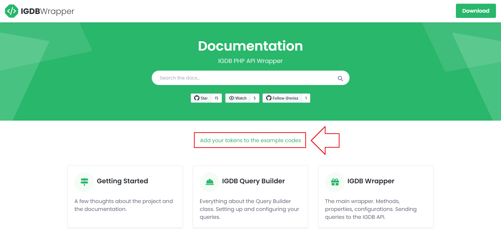

# Examples

The examples in this section will try to cover most of the use cases of the wrapper.

> To see your own tokens in the example codes set them up on the home page!



## Basic Example

A basic example to send your apicalypse query to the IGDB API.

**Code**

```php
<?php

    // importing the wrapper
    require 'class.igdb.php';

    // instantiating the wrapper
    $igdb = new IGDB("{client_id}", "{access_token}");

    // your query string
    $query = 'search "uncharted"; fields id,name,cover; limit 5; offset 10;';

    try {
        // executing the query
        $games = $igdb->game($query);

        // showing the results
        var_dump($games);
    } catch (IGDBEnpointException $e) {
        // a non-successful response recieved from the IGDB API
        echo $e->getMessage();
    }

?>
```

**Result**

```text
array (size=5)
  0 =>
    object(stdClass)[3]
      public 'id' => int 125062
      public 'cover' => int 83686
      public 'name' => string 'Uncharted Ocean: Set Sail' (length=25)
  1 =>
    object(stdClass)[4]
      public 'id' => int 19583
      public 'cover' => int 15883
      public 'name' => string 'Uncharted: Fight for Fortune' (length=28)
  2 =>
    object(stdClass)[5]
      public 'id' => int 26193
      public 'cover' => int 85149
      public 'name' => string 'Uncharted: The Lost Legacy' (length=26)
  3 =>
    object(stdClass)[6]
      public 'id' => int 19609
      public 'cover' => int 85164
      public 'name' => string 'Uncharted: Fortune Hunter' (length=25)
  4 =>
    object(stdClass)[7]
      public 'id' => int 7331
      public 'cover' => int 81917
      public 'name' => string 'Uncharted 4: A Thief's End' (length=26)
```

> Make sure to place your query builder and endpoint methods in a try...catch block to be able to catch errors!

## Using the Query Builder

An example to see how to use the [IGDB Query Builder](#igdb-query-builder) to build the query strings.

**Code**

```php
<?php

    // importing the wrapper
    require 'class.igdb.php';

    // instantiating the wrapper
    $igdb = new IGDB("{client_id}", "{access_token}");

    // instantiate the query builder
    $builder = new IGDBQueryBuilder();

    try {
        // building the query
        $query = $builder
            // searching for games LIKE uncharted
            ->search("uncharted")
            // we want to see these fields in the results
            ->fields("id, name, cover")
            // we only need maximum 5 results per query (pagination)
            ->limit(5)
            // we would like to show the third page; fetch the results from the tenth element (pagination)
            ->offset(10)
            // process the configuration and return a string
            ->build();

        // executing the query
        $games = $igdb->game($query);

        // showing the results
        var_dump($games);
    } catch (IGDBInvalidParameterException $e) {
        // an invalid parameter is passed to the query builder
        echo $e->getMessage();
    } catch (IGDBEnpointException $e) {
        // a non-successful response recieved from the IGDB API
        echo $e->getMessage();
    }

?>
```

**Result**

```text
array (size=5)
  0 =>
    object(stdClass)[3]
      public 'id' => int 125062
      public 'cover' => int 83686
      public 'name' => string 'Uncharted Ocean: Set Sail' (length=25)
  1 =>
    object(stdClass)[4]
      public 'id' => int 19583
      public 'cover' => int 15883
      public 'name' => string 'Uncharted: Fight for Fortune' (length=28)
  2 =>
    object(stdClass)[5]
      public 'id' => int 26193
      public 'cover' => int 85149
      public 'name' => string 'Uncharted: The Lost Legacy' (length=26)
  3 =>
    object(stdClass)[6]
      public 'id' => int 19609
      public 'cover' => int 85164
      public 'name' => string 'Uncharted: Fortune Hunter' (length=25)
  4 =>
    object(stdClass)[7]
      public 'id' => int 7331
      public 'cover' => int 81917
      public 'name' => string 'Uncharted 4: A Thief's End' (length=26)
```

## Counting Results

An example to count the matched records.

**Code**

```php
<?php

    // importing the wrapper
    require 'class.igdb.php';

    // instantiating the wrapper
    $igdb = new IGDB("{client_id}", "{access_token}");

    // instantiate the query builder
    $builder = new IGDBQueryBuilder();

    try {
        // building the query
        $query = $builder
            // setting a filter to fetch games with rating greater than 75
            ->where(
                array(
                    'field' => 'rating',
                    'postfix' => '>',
                    'value' => 75
                )
            )
            // process the configuration and return a string
            ->build();

        // executing the query
        // note the second true parameter
        $game_count = $igdb->game($query, true);

        // showing the results
        var_dump($game_count);
    } catch (IGDBInvalidParameterException $e) {
        // an invalid parameter is passed to the query builder
        echo $e->getMessage();
    } catch (IGDBEnpointException $e) {
        // a non-successful response recieved from the IGDB API
        echo $e->getMessage();
    }

?>
```

**Result**

```text
object(stdClass)[3]
  public 'count' => int 8081
```

> When `true` is passed as the second parameter, the return value will be a simple object with only one property called `count`. For more details on the return values of the endpoint methods please refer to the [return values section](#return-values);

## Expander

Some fields are actually ids pointing to another endpoint. The expander feature is a convenient way to go into these other endpoints and access more information from them in the same query, instead of having to do multiple queries.

**Code**

```php
<?php

    // importing the wrapper
    require 'class.igdb.php';

    // instantiating the wrapper
    $igdb = new IGDB("{client_id}", "{access_token}");

    // instantiate the query builder
    $builder = new IGDBQueryBuilder();

    try {
        // building the query
        $query = $builder
            // fetching the first 2 games by id 1 and 2
            ->id(array(1,2))
            // fields can be expanded with a dot followed by the fields you want to access from a certain endpoint
            ->fields(array("name", "themes.url", "themes.name"))
            // process the configuration and return a string
            ->build();

        // executing the query
        $game_count = $igdb->game($query);

        // showing the results
        var_dump($game_count);
    } catch (IGDBInvalidParameterException $e) {
        // an invalid parameter is passed to the query builder
        echo $e->getMessage();
    } catch (IGDBEnpointException $e) {
        // a non-successful response recieved from the IGDB API
        echo $e->getMessage();
    }

?>
```

**Result**

```text
array (size=2)
  0 =>
    object(stdClass)[3]
      public 'id' => int 1
      public 'name' => string 'Thief II: The Metal Age' (length=23)
      public 'themes' =>
        array (size=3)
          0 =>
            object(stdClass)[4]
              public 'id' => int 1
              public 'name' => string 'Action' (length=6)
              public 'url' => string 'https://www.igdb.com/themes/action' (length=34)
          1 =>
            object(stdClass)[5]
              public 'id' => int 17
              public 'name' => string 'Fantasy' (length=7)
              public 'url' => string 'https://www.igdb.com/themes/fantasy' (length=35)
          2 =>
            object(stdClass)[6]
              public 'id' => int 23
              public 'name' => string 'Stealth' (length=7)
              public 'url' => string 'https://www.igdb.com/themes/stealth' (length=35)
  1 =>
    object(stdClass)[7]
      public 'id' => int 2
      public 'name' => string 'Thief: The Dark Project' (length=23)
      public 'themes' =>
        array (size=3)
          0 =>
            object(stdClass)[8]
              public 'id' => int 1
              public 'name' => string 'Action' (length=6)
              public 'url' => string 'https://www.igdb.com/themes/action' (length=34)
          1 =>
            object(stdClass)[9]
              public 'id' => int 17
              public 'name' => string 'Fantasy' (length=7)
              public 'url' => string 'https://www.igdb.com/themes/fantasy' (length=35)
          2 =>
            object(stdClass)[10]
              public 'id' => int 23
              public 'name' => string 'Stealth' (length=7)
              public 'url' => string 'https://www.igdb.com/themes/stealth' (length=35)
```

## MultiQuery

Multiquery example

**Code**

```php
<?php


    // importing the wrapper
    require 'class.igdb.php';

    // instantiating the wrapper
    $igdb = new IGDB("{client_id}", "{access_token}");

    // instantiate the query builder
    $builder = new IGDBQueryBuilder();

    try {
        // Leaving the optional third parameter, sending the request without any filters
        // Also asking for the record count by providing /count after the endpoint name
        // The method name has to be the IGDB endpoint name instead of the wrapper class method name => platforms instead of platform
        $platforms = $igdb->multiquery("platforms/count", "Count of Platforms");

        // showing the platforms
        var_dump($platforms);

        // optionally, you could pass a filter as a third parameter to narrow down the matches
        $query = $builder
            // fetching name and platforms.name fields
            ->fields(array("name", "platforms.name"))
            // where the platforms is not null and
            ->where("platforms != null")
            // where platforms is 48 (playstation)
            ->where("platforms = {48}")
            // limit the results to 1 record
            ->limit(1)
            // process the configuration and return a string
            ->build();

        $games = $igdb->mutliquery("games", "Playstation Games", $query);

        // showing the games
        var_dump($games);
    } catch (IGDBEnpointException $e) {
        // a non-successful response recieved from the IGDB API
        echo $e->getMessage();
    }

?>
```

**Result**

```text
array (size=1)
  0 =>
    object(stdClass)[3]
      public 'name' => string 'Count of Platforms' (length=18)
      public 'count' => int 172


array (size=1)
  0 =>
    object(stdClass)[4]
      public 'name' => string 'Playstation Games' (length=17)
      public 'result' =>
        array (size=1)
          0 =>
            object(stdClass)[5]
              public 'id' => int 132972
              public 'name' => string 'One Piece: Pirate Warriors 4 - Deluxe Edition' (length=45)
              public 'platforms' =>
                array (size=1)
                  0 =>
                    object(stdClass)[6]
                      public 'id' => int 48
                      public 'name' => string 'PlayStation 4' (length=13)
```